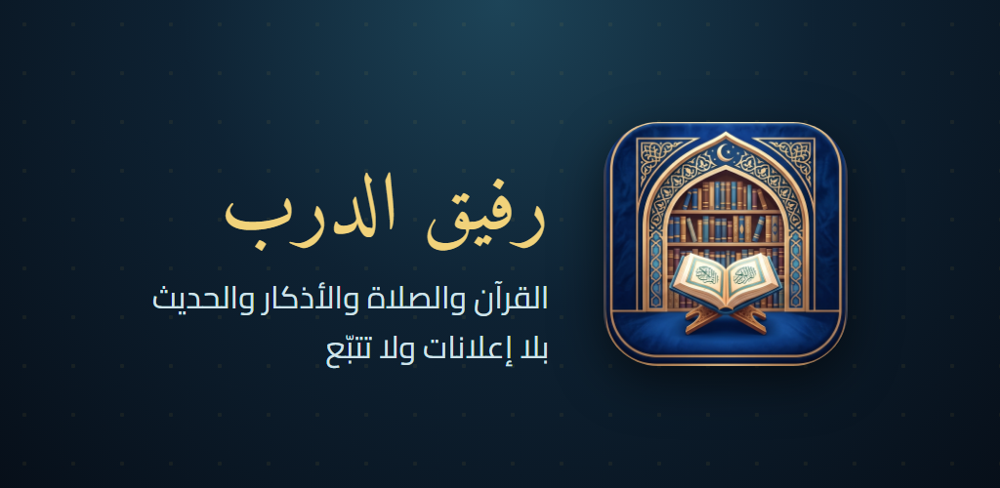
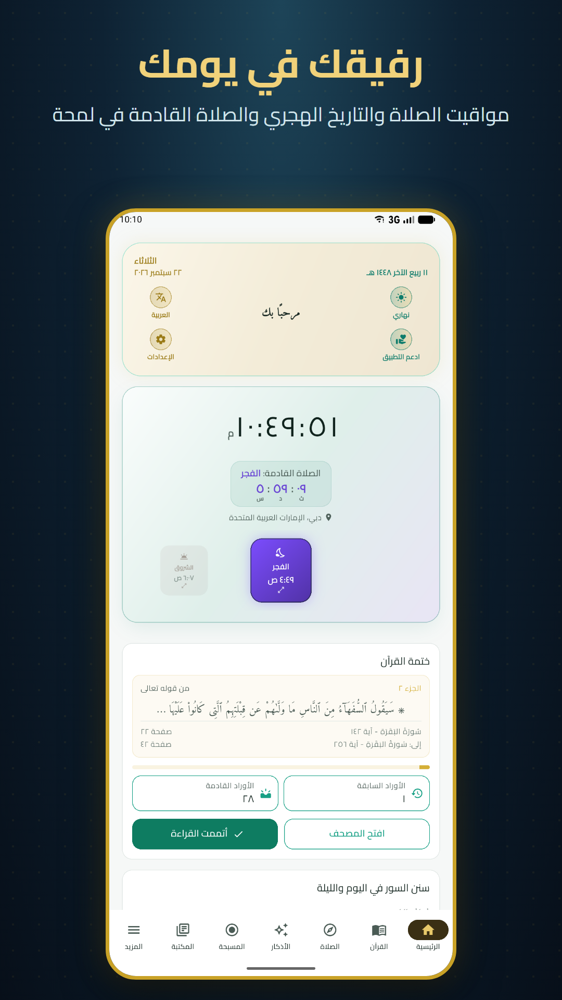
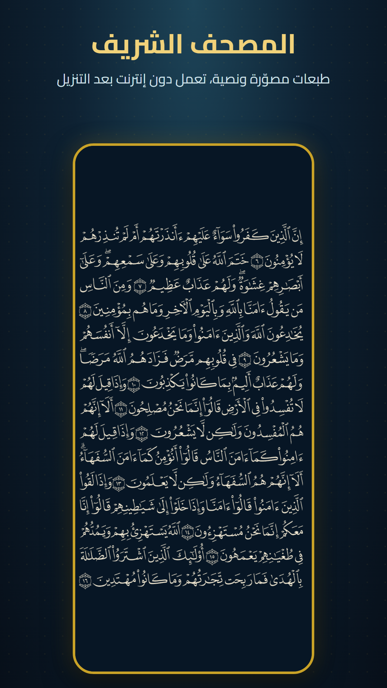
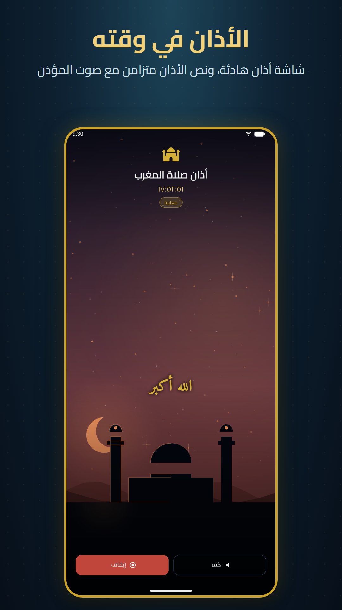
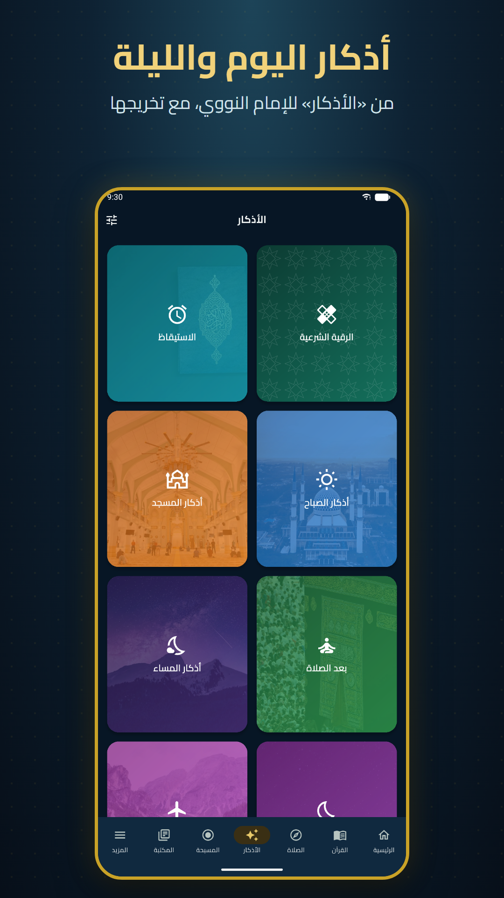
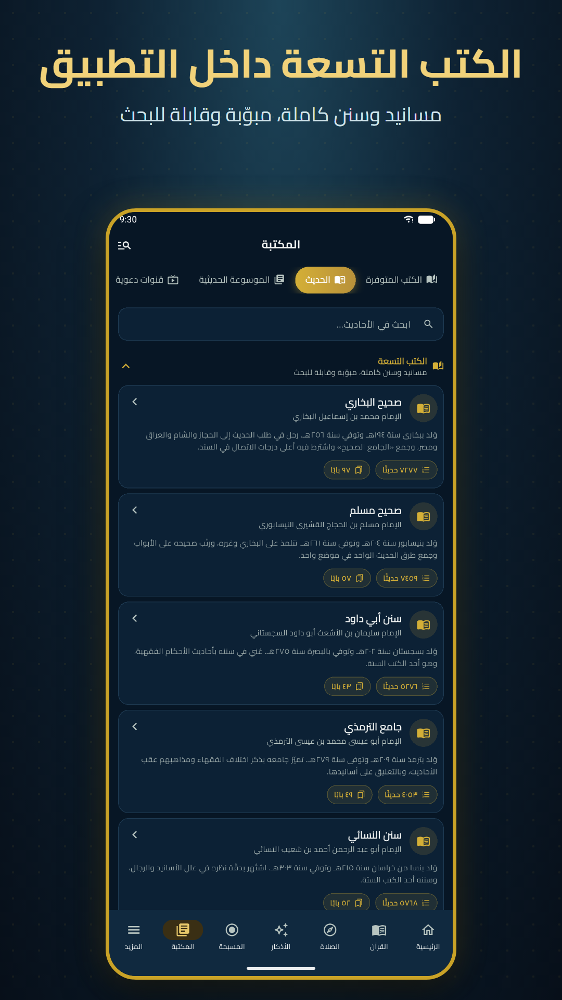
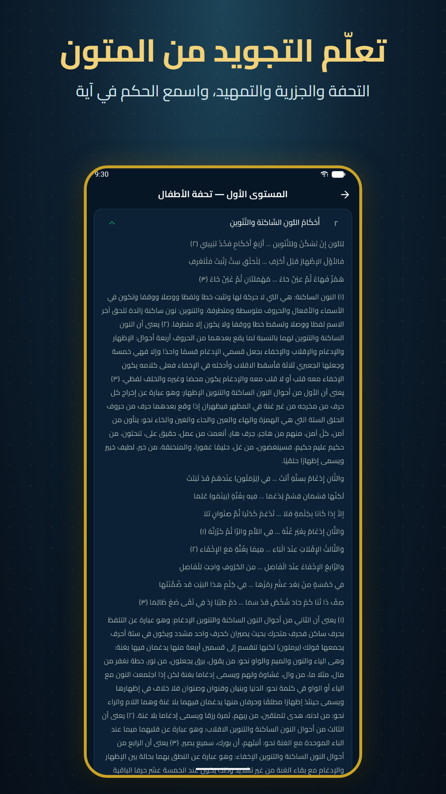
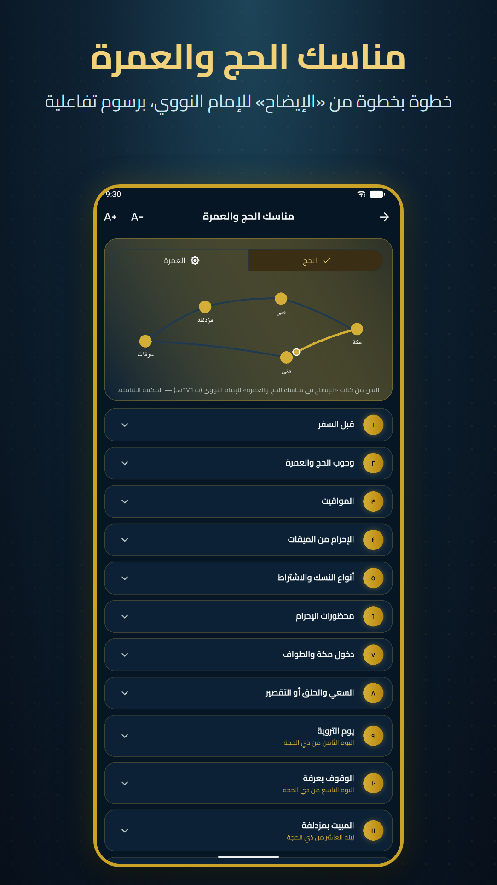
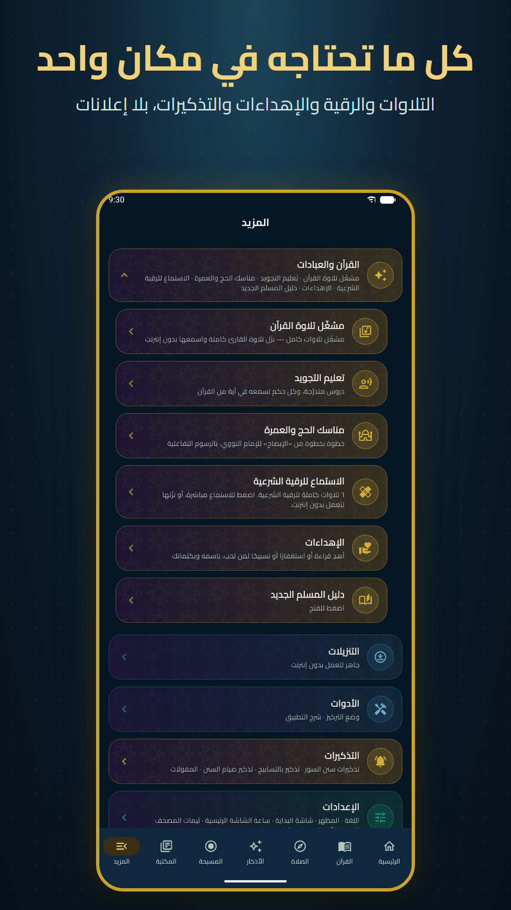

# رفيق الدرب

تطبيق إسلامي شامل لأندرويد: المصحف، ومواقيت الصلاة والأذان، والأذكار، وكتب الحديث، ودروس التجويد، ومناسك الحج والعمرة — من مصادر موثّقة ومذكورة داخل التطبيق، **بلا إعلانات ولا تتبّع**.

## التنزيل والتثبيت

1. افتح صفحة [الإصدارات (Releases)](https://github.com/tito423/Rafeeq-Al-Darb/releases/latest) ونزّل ملف `RafeeqAlDarb-v….apk`.
2. افتح الملف على هاتفك، واسمح بالتثبيت من هذا المصدر إن طلب أندرويد ذلك.
3. يعمل على أندرويد ٧ فما فوق. التحديث يُثبَّت فوق النسخة السابقة دون أن يضيع ما نزّلته.

## شرح استخدام التطبيق

| | |
|---|---|
|  | **الرئيسية** — التاريخ الهجري والميلادي، والصلاة القادمة والوقت المتبقي عليها. اضغط التاريخ الهجري لترى أحداث هذا اليوم في التاريخ. تحت التاريخين أزرار سريعة: تغيير الثيم، ودعم التطبيق، وتغيير اللغة، والإعدادات. |
|  | **المصحف** — اضغط على الصفحة لإظهار الأدوات: الانتقال إلى سورة أو صفحة، والبحث الموضوعي، والتلاوة المستمرة، والتبديل بين المصحف المصوّر والنصي. اضغط مطولًا على آية لتفسيرها وترجمتها وتلاوتها. الصفحات تُقلَّب من اليمين إلى اليسار. |
|  | **الأذان** — يُؤذَّن في وقته حتى والتطبيق مغلق. من «الصلاة ← إعدادات الأذان» تختار المؤذن لكل صلاة، وتضبط التذكير قبل الصلاة وبعدها وعند الإقامة، وتعاين الأذان. |
|  | **الأذكار** — أذكار الصباح والمساء والنوم والاستيقاظ وبعد الصلاة والسفر وغيرها، من «الأذكار» للإمام النووي مع تخريجها. اضغط على الذكر لعدّه. |
|  | **الحديث** — من «المكتبة ← الحديث»: الكتب التسعة كاملة داخل التطبيق دون تنزيل، مبوّبة، وبحث في نصوصها. وفي «كتب ومتون الحديث» الأربعون النووية وبلوغ المرام ورياض الصالحين وغيرها. |
|  | **التجويد** — من «المزيد ← تعليم التجويد»: ثلاثة مستويات (تحفة الأطفال، المقدمة الجزرية، التمهيد) ومخارج الحروف. اضغط «استمع» لتسمع الحكم في آية بصوت قارئ، و«استماع» لتسمع المتن المشكول. |
|  | **الحج والعمرة** — من «المزيد ← مناسك الحج والعمرة»: الخطوات بالترتيب من «الإيضاح» للإمام النووي، مع رسوم تفاعلية للطواف والسعي ورمي الجمار. زرّا A+ وA− لتكبير الخط وتصغيره. |
|  | **المزيد** — كل الأقسام في بطاقات تُفتح بضغطة: التلاوات، والرقية، والإهداءات، والتذكيرات، والإعدادات (اللغة، والثيم، والخط، وشاشة البداية، وقارئ الكتب)، والحساب والمزامنة. وفيه «شرح ميزات واستخدام التطبيق» لجولة داخل التطبيق نفسه. |

**وأيضًا:** المسبحة (٣٣ أو ١٠٠ أو ١٠٠٠ أو بلا حد أو عدد تختاره)، وبوصلة القبلة، ومكتبة من ٢١٣ كتابًا يُقرأ ٨٣ منها بصوت القارئ (تبويب «مسموعة»)، وترجمات معاني القرآن بـ ٤٥ لغة، وواجهة بسبع لغات.

## الخصوصية

لا حساب مطلوب، ولا إعلانات، ولا أدوات تحليل أو تتبّع. التفاصيل في [سياسة الخصوصية](https://pub-39dbef68a1a845d5ba669b43a59516b9.r2.dev/legal/privacy.html).

## دعم التطبيق

التطبيق مجاني بالكامل. ومن شاء أن يشارك في تكلفة استضافة المحتوى فمن زر «ادعم التطبيق» داخله، أو من [هنا](https://paypal.me/Tito320) — والمبلغ تختاره أنت، ولا يتغير شيء في التطبيق في الحالتين.

## مصادر المحتوى

كل مصدر مذكور داخل التطبيق في «المزيد ← عن التطبيق ← المصادر والمراجع»، مع رابطه. وسجلّ الرخص في [CONTENT-LICENSES.md](CONTENT-LICENSES.md).

